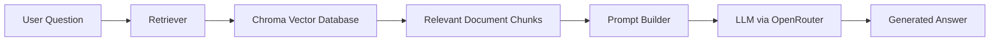
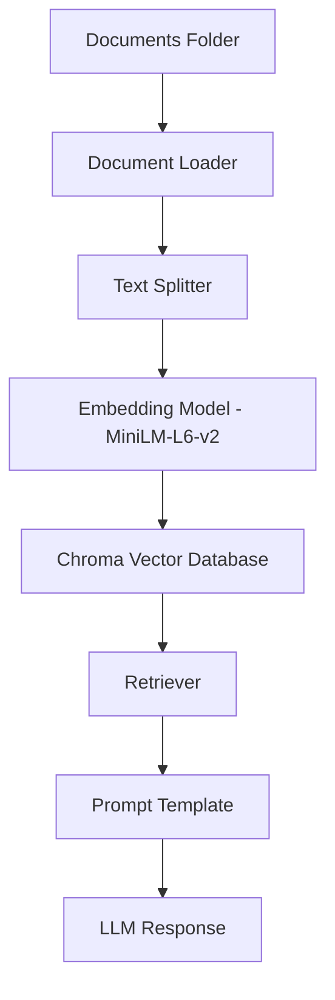

# AI Document Assistant (RAG)

A Retrieval-Augmented Generation (RAG) application that allows users to ask questions about their private documents.

The system ingests documents, converts them into embeddings, stores them in a vector database, and retrieves relevant context to generate accurate answers using a language model.

This project demonstrates how to build a document-aware chatbot using LangChain, HuggingFace embeddings, and ChromaDB.

---

## Overview

Large language models do not have access to private or domain-specific data by default. Retrieval-Augmented Generation (RAG) solves this problem by retrieving relevant information from a knowledge base and providing it to the model as context during generation.

This project implements a simple RAG pipeline that allows users to query their own documents.

---

## Architecture



### Pipeline Explanation

1. A user submits a question  
2. The question is converted into an embedding  
3. The vector database retrieves the most relevant document chunks  
4. Retrieved context is combined with the user question in a prompt  
5. The language model generates the final response  

---

## RAG Pipeline



---

## Technology Stack

| Component | Technology |
|--------|--------|
| Framework | LangChain |
| Embeddings | HuggingFace Sentence Transformers |
| Vector Database | ChromaDB |
| LLM Provider | OpenRouter |
| Language | Python |
| Document Parsing | PyPDF |

---

## Project Structure

```
rag-document-assistant
│
├── documents/          # Source documents
├── vector_db/          # Generated vector database
│
├── ingest.py           # Document ingestion pipeline
├── chat.py             # Chat interface
│
├── requirements.txt
├── .gitignore
└── README.md
```

---

## Installation

### 1. Clone the repository

```bash
git clone https://github.com/YOUR_USERNAME/rag-document-assistant.git
cd rag-document-assistant
```

### 2. Create a virtual environment

```bash
python -m venv .venv
source .venv/bin/activate
```

### 3. Install dependencies

```bash
pip install -r requirements.txt
```

---

## Environment Variables

Create a `.env` file in the project root:

```
OPENAI_API_KEY=your_openrouter_api_key
OPENAI_BASE_URL=https://openrouter.ai/api/v1
```

---

## Adding Documents

Place your documents inside the `documents/` folder.

Supported formats:

- PDF
- TXT

---

## Build the Vector Database

Run the ingestion pipeline:

```bash
python ingest.py
```

This will:

1. Load documents  
2. Split them into chunks  
3. Generate embeddings  
4. Store them in ChromaDB  

---

## Run the Chat Application

```bash
python chat.py
```

Example interaction:

```
Ask a question: What is the main topic of the document?

Answer:
The document discusses ...
```

---

## Example RAG Flow

```
User Question
      ↓
Vector Search
      ↓
Relevant Document Chunks
      ↓
Prompt + Context
      ↓
LLM Response
```

---

## Future Improvements

Possible extensions include:

- Web interface using Streamlit or FastAPI  
- Support for additional document formats  
- Hybrid search (keyword + vector search)  
- Multi-turn conversation memory  
- REST API for integration  

---

## License

MIT License

---

## Author

Arpit